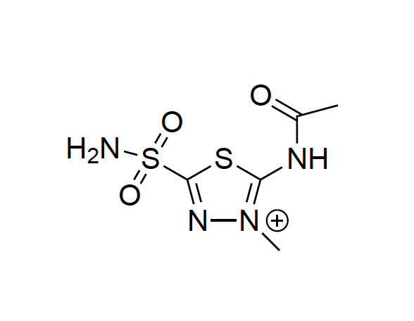
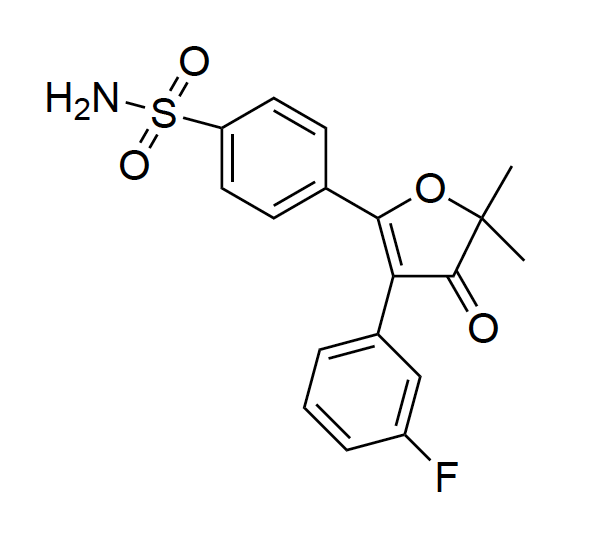
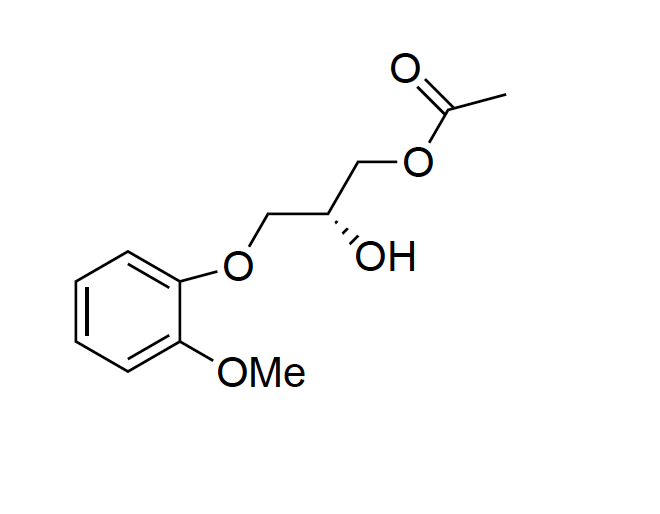
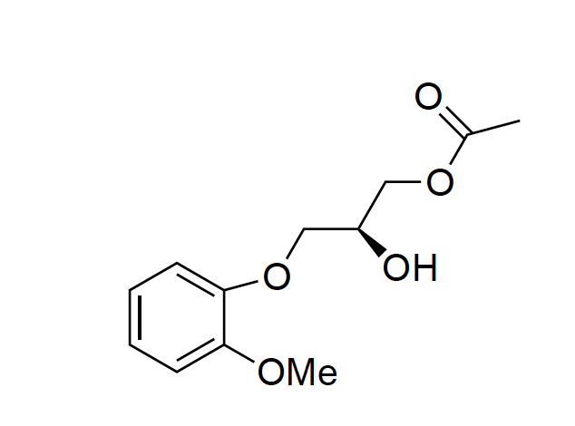
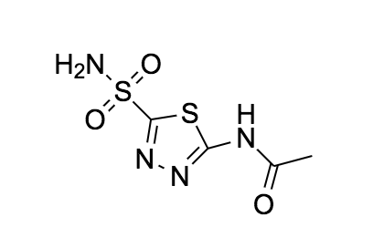
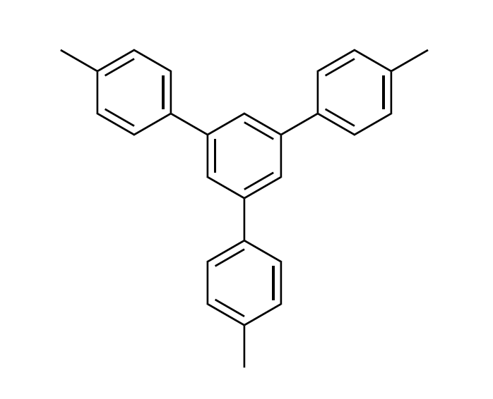
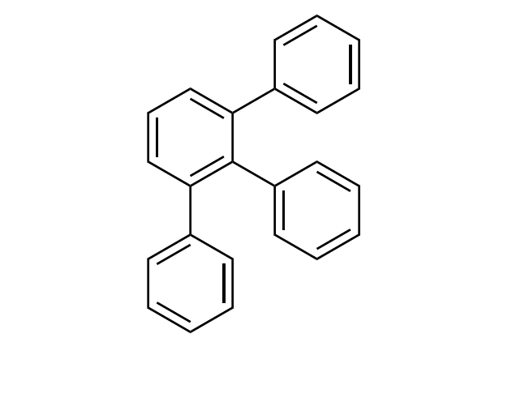
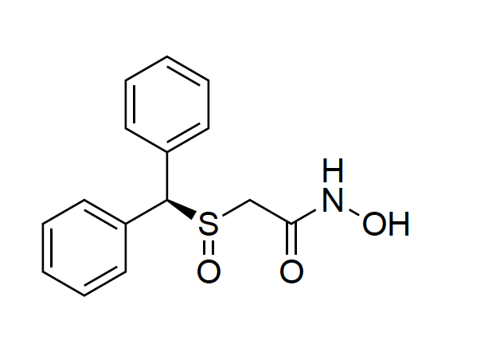
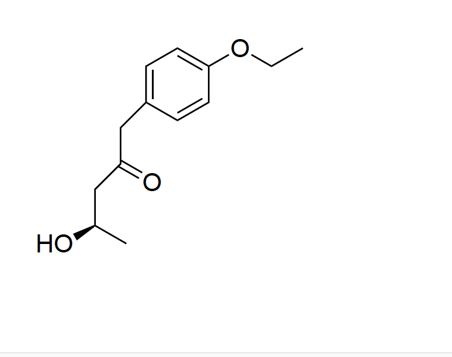
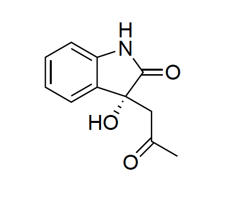

# DeepCure

** Problem Set for Interview **

## Links
- Progress Tracker: [./docs/sources/CHANGELOG.md](./docs/sources/CHANGELOG.md)
- Error Log: [./docs/sources/ERRORLOG.md](./docs/sources/ERRORLOG.md)

## Section 1: Virtual Docking

**Background**: To improve the accuracy and consistency of current virtual docking algorithms,
we are developing DeepDockR, a machine learning powered docking platform. Achieving that
requires us to dock thousands of molecules into a target of interest and store all associated
scores and metadata in our database. While we have automated much of the docking pipeline,
a very important step is the choice and preparation of the structures to use for docking.

**Goal**: Evaluate the performance of a docking software in estimating the binding affinity of
compounds to Carbonic Anhydrase I, by comparing the virtual docking results to available
bioactivity data. The evaluation should comprise of regression and as well as ranking metrics.

### Protein Evaluation 

To tackle this goal we need to evaluate the protein in question. Protein's can exist in several different states but for evaluation of a docking software the user should pick a protein that is already in a docked state. Here we can determine what what exactly the pocket size looks like and how it interacts with a possible therapuetic inside of the protein. 
    
The problem asks for evaluation of docking for CA1, to initialize we are going to big an undocked ligand into the protein which stems from the x-ray structure 2CAB.  [2cab.pdb](http://www.rcsb.org/structure/2CAB) which has the zinc ion in the pocket of the protein in the protein docked state which can be the most unbiased x-ray structure and prove as the docked protein template.

### Ligand Selection 

For our ligand selection we need enough chemical space to explore known inhitors, negative inhibitors, and possible positive inhibitors that match functional groups revelant to the known inhibitors. The ligands that I have chosen for this project are listed below. 

Known Inhibitors            |  Common Name
:-------------------------:|:-------------------------:
 |  Methazolamide
  |  Polmacoxib
 |  (R)-Methocarbamol
 |  (S)-Methocarbamol
 |  Acetazolamide

Negative Inhibitors            |  Common Name
:-------------------------:|:-------------------------:
 |  Terphenyl
  |  Triphenylbenzene

Positive Inhibitors            |  Common Name
:-------------------------:|:-------------------------:
 |  Adrafinil
  |  Bucetin
 |  Indol

