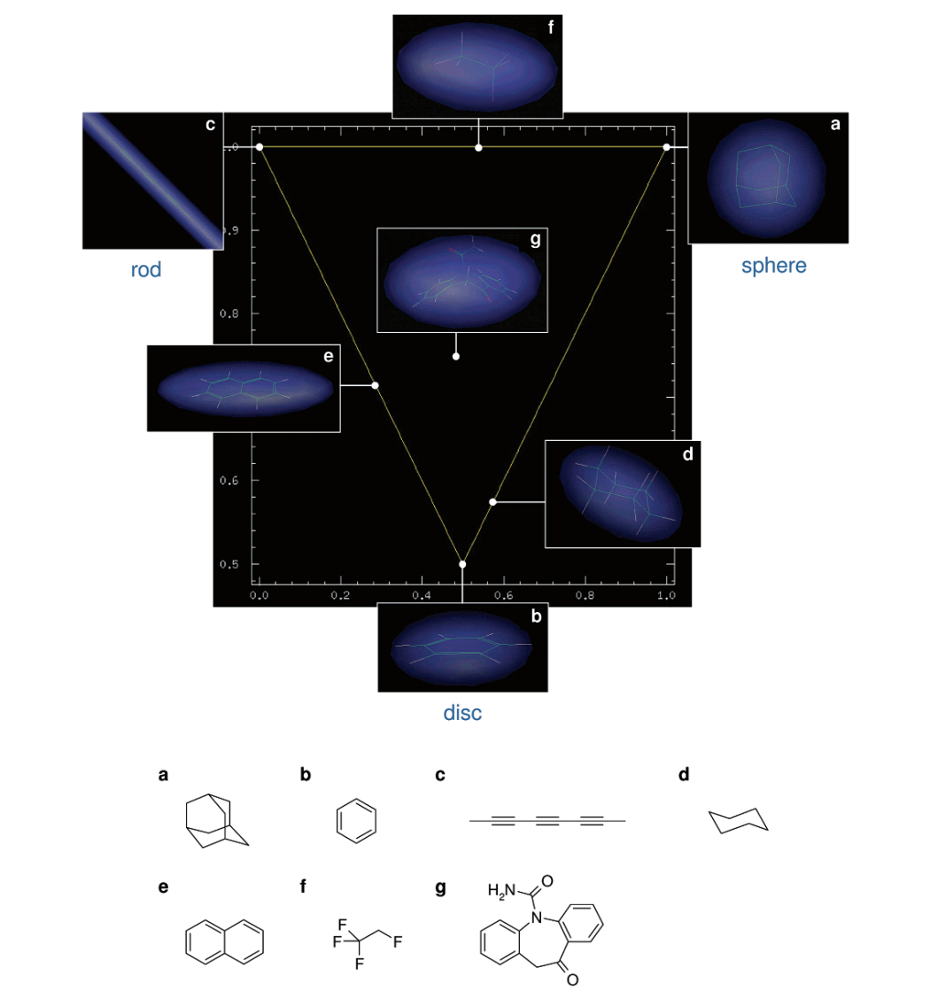
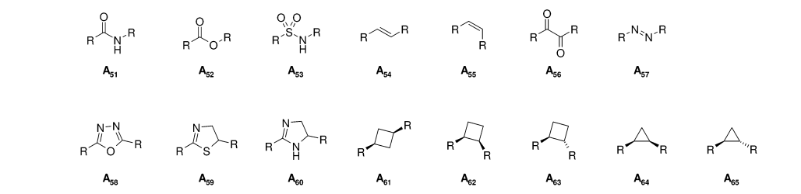
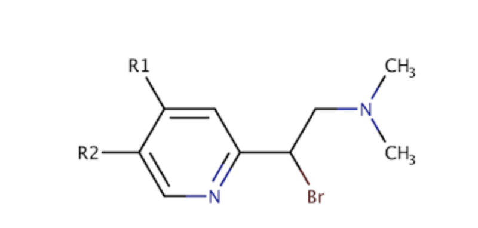
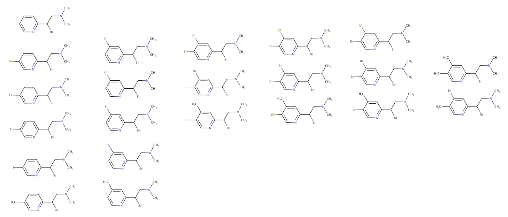
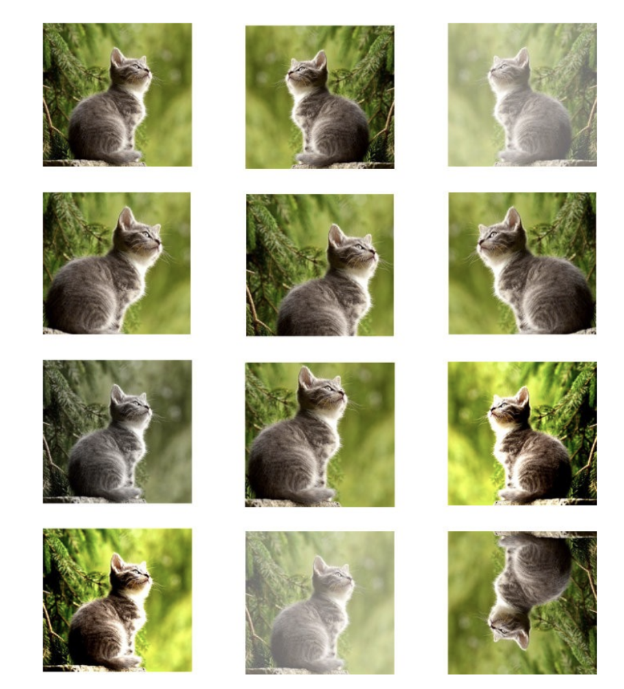
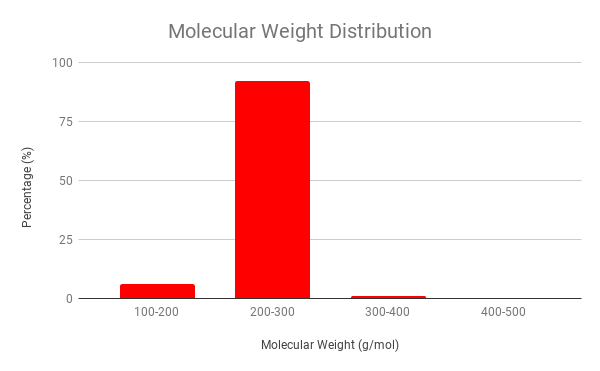
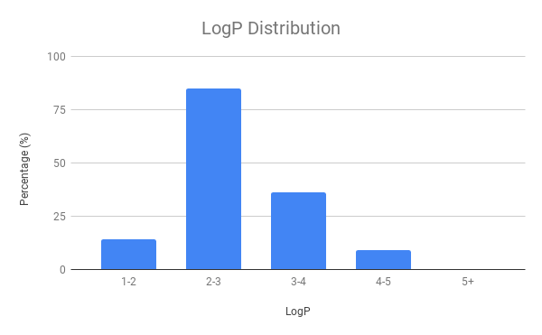
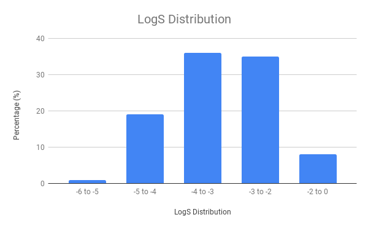
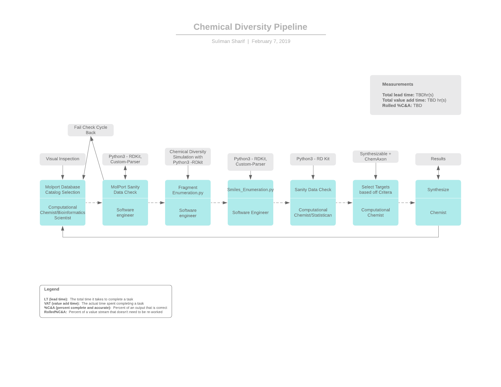

# Software Evaluation

## Links
- Progress Tracker: [./docs/sources/CHANGELOG.md](./docs/sources/CHANGELOG.md)
- Error Log: [./docs/sources/ERRORLOG.md](./docs/sources/ERRORLOG.md)
- Ligand Selection [./docs/sources/LIGANDSELECTION.md](./docs/sources/LIGANDSELECTION.md)
- Docking Instructions [./docs/sources/DOCKINGINSTRUCTIONS.md](./docs/sources/DOCKINGINSTRUCTIONS.md)

## Section 1: Virtual Docking

**Background**: To improve the accuracy and consistency of current virtual docking algorithms,
we are developing DeepDockR, a machine learning powered docking platform. Achieving that
requires us to dock thousands of molecules into a target of interest and store all associated
scores and metadata in our database. While we have automated much of the docking pipeline,
a very important step is the choice and preparation of the structures to use for docking.

**Goal**: Evaluate the performance of a docking software in estimating the binding affinity of
compounds to Carbonic Anhydrase I, by comparing the virtual docking results to available
bioactivity data. The evaluation should comprise of regression and as well as ranking metrics.

### Protein Evaluation 

To tackle this goal we need to evaluate the protein in question. Protein's can exist in several different states but for evaluation of a docking software the user should pick a protein that is already in a docked state. Here we can determine what what exactly the pocket size looks like and how it interacts with a possible therapuetic inside of the protein. 
    
The problem asks for evaluation of docking for CA1, to initialize we are going to big an undocked ligand into the protein which stems from the x-ray structure 2CAB. We are luxurious enough to have a well defined active site that has the correct protein conformation that will be more relevant to the binding pose for the potential ligands binding to the complex. 
[2cab.pdb](http://www.rcsb.org/structure/2CAB) 
which has the zinc ion in the pocket of the protein in the protein docked state which can be the most unbiased x-ray structure and prove as the docked protein template.

If we did not have knowledge of the active site we will use a software such as AutoLigand that will help us identify where the active site could potentially be. 

### Ligand Selection 

For our ligand selection we need enough chemical space to explore known inhitors, negative inhibitors, and possible positive inhibitors that match functional groups revelant to the known inhibitors. The ligands that I have chosen for this project are listed in [Ligand Selection](./docs/sources/LIGANDSELECTION.md)

Reason behind the ligand choices are what is most avaliable to me! My choices of ligands also stem from the ZINC Database because I ran into complications with the CHEMBL database. Follow the error log to get more insight. 

Known inhibitors: are great so we can evaluate what the Kd potentials will be from the Autodock and already pre-screened values that are available online. Also if we super impose images of docked ligands with docked proteins we can evaluate x-ray or nmr determined structures with the virtual docking software to evaluate correct poses. 

Negative inhibitors: were determined through manual inspection, after determining the pocket size of the active-site of the protein I could infer what wouldn't fit so I selected large bulky phenyl compounds that also lacked in relative functional groups to reach the zinc site. 

Positive inhibitors: were selected from a blend of what was available from the ZINC Database and similarity functional groups as th known inhibitors. 

### Grid Selection

On preparation of the protein-ligands for autodocking, we need to prep the protein using the AutoDock tools. We can use Autodock tools to select hydrogen atoms, solvent interactions, merging non-polar hydrogen atoms onto their respective heavy atoms, and assigning atom types.

Protein charges are implemented using force fields. For this experiment we will be using AMBER (AM1-BCC) that semi-emperical quantum mechanics to determine correct states. It's more accurate but slower than other force field rendering. 

Using Chimera we will also be able to detect the sum of atomic charges lead to to an integer matching the summary charges.

Docking Site Preparation, I set up a 3D grid of where the active site of the protein complex is. Because we are fortunate enough to have this active site known we can narrow down our search for potential inhibitors. Usually the active site would be determined through a 2D NMR approach or X-ray to evaluate where ligands are binding in corresponding to amino acids. 

Here you can see the grid formation of the ligand. 

For docking instructions please follow the  

### Results

This was a challenge for analysis of the docking results. We are limited by both the software and the results of the complexes and also how the software calculated it's scoring function. 

AutoDock Vina seems to be running it's own scoring function that doesn't directly correlate to a Kd value. The Kd will be widely used as the primary docking measurement to detect the binding efficiency of the ligand. 

To calculate the Kd Value we have a couple of parameters that are not in our control 
- Concentration of the Ligand | Autodock Vina assumes it is at 1nM
- PH Level | AutoDock Vina assumes it is at 7~8
- Temperature | AutoDock Vina assumes it is at 25 C or 298K 

We are also limited by the data available:
- online pdb banks
- publication restrictions
- ligands that haven't been tested before. 

Results of the file are labeled here in this Excel Doc with only Kd Values caluclated and one correlation based on the ZINC ID of the compound. 

We can test the docking performance of Autodock Vina on 3 main categories. 
- Predicted Free Energy of the Compound
- Clustered Docking Conformations based on the RMSD Coordindates
- Visual Inspection of the Docking Poses 

Compound            |  Kinetic Energy Results
:-------------------------:|:-------------------------:
Methazolamide | Kd Value was either 1. Not publicaly available, or 2. Very hard to find in relation to just CA1 of the chain.
Polmacoxib | Km Values exist but because of the complexity of the binding of Polmaxocib didn't take into account Chain A, Chain B, and Chain C.
(R)-Methocarbamol | Ki Values exist at an alarming rate of 50nm. A different so large it must be a concentration play at hand yield the error pretty much inconclusive. Hard to find the R binding.
(S)-Methocarbamol |  Ki Values exist at an alarming rate of 50nm. A different so large it must be a concentration play at hand yield the error pretty much inconclusive. 
Acetazolamide | Kd Values Determined. Known Values Determined. Correlated to have a difference of 0.000486 kcal/mol. 
Terphenyl | Kd Values Determined (No Known Values)
Triphenylbenzene | Kd Values Determined (No Known Values)
Adrafinil | Kd Values Determined (No Known Values)
Bucetin | Kd Values Determined (No Known Values)
Indol | Kd Values Determined (No Known Values)

Compound            |  Coordinate Results
:-------------------------:|:-------------------------:
Methazolamide | 
Polmacoxib | 
(R)-Methocarbamol | 
(S)-Methocarbamol |   
Acetazolamide |  
Terphenyl | No Comparable Coordinates 
Triphenylbenzene |No Comparable Coordinates 
Adrafinil | No Comparable Coordinates 
Bucetin | No Comparable Coordinates 
Indol | No Comparable Coordinates 

 

Compound            |  Visual Inspection Results
:-------------------------:|:-------------------------:
Methazolamide | Direct Binding into the active site and seemingly correct pose in the pocket validating inhibitor
Polmacoxib | Direct Binding into the active site and seemingly correct pose in the pocket validating inhibitor. Also expansion of the Chains, A and B you can verify that the conformation looks seemingly correct. 
(R)-Methocarbamol | Direct Binding into the active site and seemingly correct pose in the pocket validating inhibitor
(S)-Methocarbamol |  Direct Binding into the active site and seemingly correct pose in the pocket validating inhibitor
Acetazolamide | Direct Binding into the active site and seemingly correct pose in the pocket validating inhibitor
Terphenyl | Barely fits into the mouth of pocket as predicted and fails to even reach the active site
Triphenylbenzene | Barely fits into the mouth of the pocked as predicted and also again fails to reach the active site. 
Adrafinil | Weaker binding that inhibitors but also due to the bulkiness of the phenyls prevents it from reaching the active site. 
Bucetin | Surprisingly interested results and reaches the active site. Looks like it will have very strong binding and could serves an anchor for a more potent therapeutic. 
Indol | Weak Binding but reaches the active site. 

### Opinion

Based on current efforts and results from this experiment, it proved to be not entirely inconclusive. Running experiments on negative controls helped the correlation to discover that AutoDock Vina showed what can be potentially bound and what cannot be. With the positive random inhibitors based on the functional groups of the known inhibitors we can predict to see what are lead potential therapeutics based solely on the AutoDock Vina score and free energy calculations. 

Although we have some limiting factors
 -  The lack of data that is publicaly available or the lack of data in general between ligands and proteins. Because of how expensive it can be to run NMR, ITC, and X-Ray Diffractions on protein-ligand complexes we lack a lot of chemical data which would prove useful in the effectiveness of the software
 - The force fields used in the docking are only used to calculate using a single conformation of the complex with fixed stable parameters. 
 
 Because of the complications with the docking software, at most, in it's current form we can use to identify potential binding functional groups and potential poses. It could serve as a beginning start to early stage drug-discovery but not capable enough of pushing out a drug. A major advancement in scoring functions will take in more parameters such as liver clearance, higher force field calculations with protein-ligand flexibilty, and cross chain pocket evaluation. As of right now we do need more manual inspection to drive AutoDock Vina futher. 

## Section 2: Virtual Docking

**Background:** DeepCure’s ML algorithms are capable of searching extensive chemical spaces
for the best starting points for a drug development program. This leaves us with the question of
how do we design and construct the virtual library which will be searched during this process.

**Goal:** Construct a library of 10,000 distinct compounds, which are all synthesizable. The library
should be optimized for chemical diversity, to span as much of the chemical space as possible.

This problem target the main apex pain point hindering chemical modeling today. Given the rise of the genomic and protenoimics have discovered therapeutic targets with no small molecule modulators. The demand asks for more increased virtual high throughput screening but with a lack of adequate screening libraries. 

Questions arise:
    - How do we construct these chemical libraries?
    - How do we construct these chemical libraries expanding the most chemical diversity possible?
    - How do we construct chemical libraries exploring as many combinations of representation of data as possible? 
    - Added on to this what style of chemical libaries are we constructing? (Natural/Non-Natural Amino Acids versus small molecule inhibitors) 
    - How do we create these chemical libraries so it adheres to easy synthesis or, to make the chemists happy, can be constructed through click chemistry methods.
    - How do construct datasets that are not in violation with existing patents for pharma companies today? 

#### Ligand Selection

For this study I am using the MolPort catalog as my dataset. Molport is a free open source database housing ~4.2mil+ compounds used as building blocks. Molport's database is diverse enough in terms of Chemical Space where we can explore freely. 

There's a couple of things we need to consider for choosing our data set and I've gone for the Principal Moments of Inertia approach. 

What this really entails that a molecule would fit into one of three different shapes or be more geared towards one direction (rod, sphere, or disc).

    - Rod: Means the molecule is more elongated like a peptide backbone chain
    - Sphere: Means the molecule is more 3D for example bridged conformations.
    - Disc: Means the molecule is more 2D but round. For example benzene rings are disc-like but with the sp2 carbons they remain flat.
    
For a first pass implementation of the docking to a protein of unknown character we can extrapolate the information based on what type of shape the protein responds to. 

The graph would be a depiction like this with example molecules listed below:

So what would our dataset of molecules look like:

Here is an example of what is being used in the experiment:

And maybe more within the imgs folder. 

So if we choose roughly ~100 molecules that's not too many to get an accurate analysis, how do we enumerate this dataset. Hint: Read to the next section....

#### Enumeration

How are we going to Enumerate these molecules, well the idea stems from Eugene A. Markush who invented the representation of a foundation molcule with selective R Groups. These R groups could range from anything and used to gain complete statistical 2D rendering of molecules that are synthesizable.  

Here is an example of a Markush Structure:

We can actually use markush structures to expand the 2D set the only conflicting ideaology is that we might run into some legal issues when extrapolating data. 

What's the algorithm for doing such things? Well thankfully someone already has actually tackled that for us. Free-Wilson implement a SAR analysis for markush structures that help us in computationally designing an experiment. 

I've included the python implementation of the Free-Wilson Library below (with some modifications) to help us generate the structure.

Here is an example of enumeration:

So we can combine the R groups with our scaffold molecule and we have automatically 22 molecules with different combinations! 

What if we enumerated our dataset of 100 molecules times the 22 modifications to the R Groups, based on what we can remove and then implement. The results can be exponential. If you head into the free wilson implementation and preparation of the molcules we can run through just that. 

#### Enumeration

Since we are implementing for a machine learning algorithm we need to verify that we are augmenting the data. What do I really mean by that?

Well machine learning algorithms need all representations of the data to make a reasonable conclusion.

For example take this cat photo:

Here we have representation of a cat in all different forms, the algorithm will have to learn that all of these images are still a cat at it's core. 

This is the same case as SMILES for feeding into data sets. We need to actually have multiple representation of SMILES.

Conveniently, there is a script inside labeled as enumerate_smiles.py that does exactly that! 

With one molecule we can average generated ~75 smiles variations depedent on size of the molecule. 

So with our molecule set I enumerated all smiles and what do you know we have roughly 5000+ different smiles representation of molecules with combinations of R group.

Our molecular weight distribution looks a little like this:

Our LogP Graph:

The experiment will head into workflow like so:

Future Implementations that do not include tomorrow's presentation:

RetroPath 2.0
Automatic Markush Construction
Patent Search
