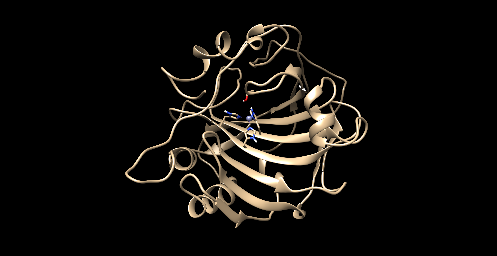
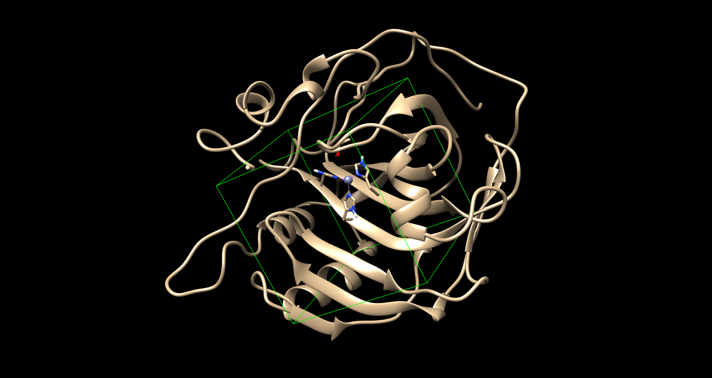

# DeepCure

** Problem Set for Interview **

## Links
- Progress Tracker: [./docs/sources/CHANGELOG.md](./docs/sources/CHANGELOG.md)
- Error Log: [./docs/sources/ERRORLOG.md](./docs/sources/ERRORLOG.md)
- Ligand Selection [./docs/sources/LIGANDSELECTION.md](./docs/sources/LIGANDSELECTION.md)

## Section 1: Virtual Docking

**Background**: To improve the accuracy and consistency of current virtual docking algorithms,
we are developing DeepDockR, a machine learning powered docking platform. Achieving that
requires us to dock thousands of molecules into a target of interest and store all associated
scores and metadata in our database. While we have automated much of the docking pipeline,
a very important step is the choice and preparation of the structures to use for docking.

**Goal**: Evaluate the performance of a docking software in estimating the binding affinity of
compounds to Carbonic Anhydrase I, by comparing the virtual docking results to available
bioactivity data. The evaluation should comprise of regression and as well as ranking metrics.

### Protein Evaluation 

To tackle this goal we need to evaluate the protein in question. Protein's can exist in several different states but for evaluation of a docking software the user should pick a protein that is already in a docked state. Here we can determine what what exactly the pocket size looks like and how it interacts with a possible therapuetic inside of the protein. 
    
The problem asks for evaluation of docking for CA1, to initialize we are going to big an undocked ligand into the protein which stems from the x-ray structure 2CAB. We are luxurious enough to have a well defined active site that has the correct protein conformation that will be more relevant to the binding pose for the potential ligands binding to the complex. 
[2cab.pdb](http://www.rcsb.org/structure/2CAB) 
which has the zinc ion in the pocket of the protein in the protein docked state which can be the most unbiased x-ray structure and prove as the docked protein template.

If we did not have knowledge of the active site we will use a software such as AutoLigand that will help us identify where the active site could potentially be. 

### Ligand Selection 

For our ligand selection we need enough chemical space to explore known inhitors, negative inhibitors, and possible positive inhibitors that match functional groups revelant to the known inhibitors. The ligands that I have chosen for this project are listed in [Ligand Selection](./docs/sources/LIGANDSELECTION.md)

Reason behind the ligand choices are what is most avaliable to me! My choices of ligands also stem from the ZINC Database because I ran into complications with the CHEMBL database. Follow the error log to get more insight. 

Known inhibitors: are great so we can evaluate what the Kd potentials will be from the Autodock and already pre-screened values that are available online. Also if we super impose images of docked ligands with docked proteins we can evaluate x-ray or nmr determined structures with the virtual docking software to evaluate correct poses. 

Negative inhibitors: were determined through manual inspection, after determining the pocket size of the active-site of the protein I could infer what wouldn't fit so I selected large bulky phenyl compounds that also lacked in relative functional groups to reach the zinc site. 

Positive inhibitors: were selected from a blend of what was available from the ZINC Database and similarity functional groups as th known inhibitors. 

### Grid Selection

On preparation of the protein-ligands for autodocking, we need to prep the protein using the AutoDock tools. We can use Autodock tools to select hydrogen atoms, solvent interactions, merging non-polar hydrogen atoms onto their respective heavy atoms, and assigning atom types.

Protein charges are implemented using force fields. For this experiment we will be using AMBER (AM1-BCC) that semi-emperical quantum mechanics to determine correct states. It's more accurate but slower than other force field rendering. 

Using Chimera we will also be able to detect the sum of atomic charges lead to to an integer matching the summary charges.

Docking Site Preparation, I set up a 3D grid of where the active site of the protein complex is. Because we are fortunate enough to have this active site known we can narrow down our search for potential inhibitors. Usually the active site would be determined through a 2D NMR approach or X-ray to evaluate where ligands are binding in corresponding to amino acids. 

Here you can see the grid formation of the ligand. 

