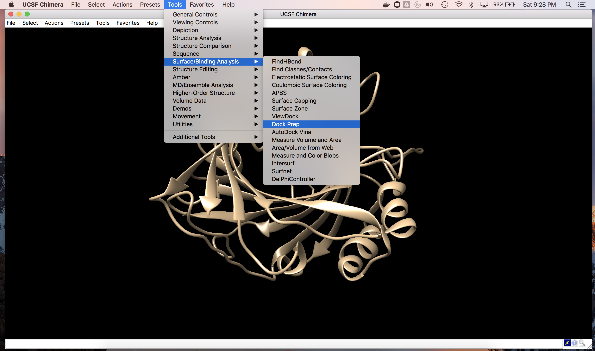
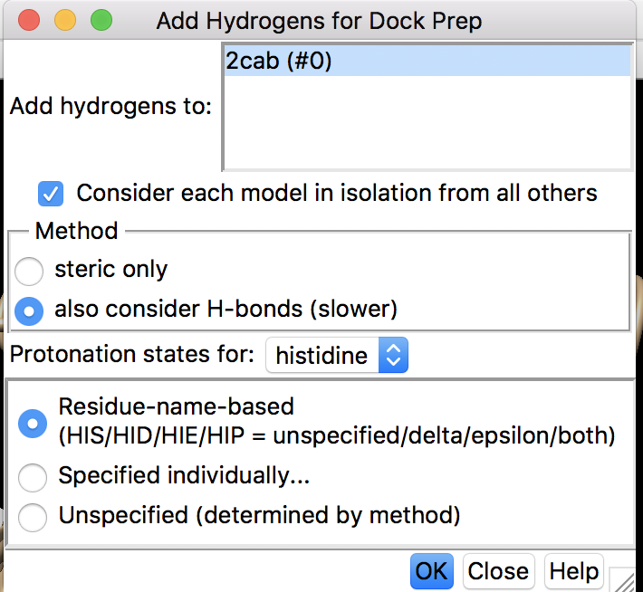
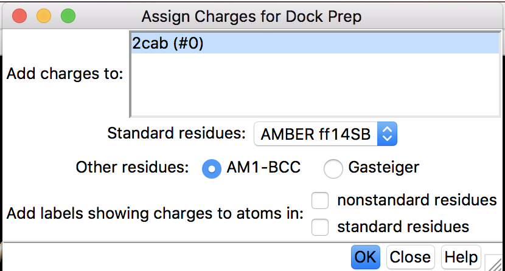
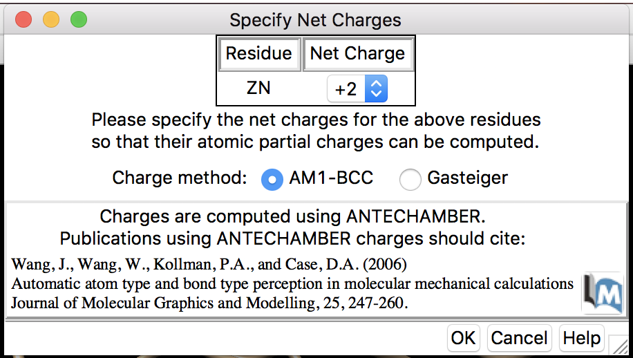
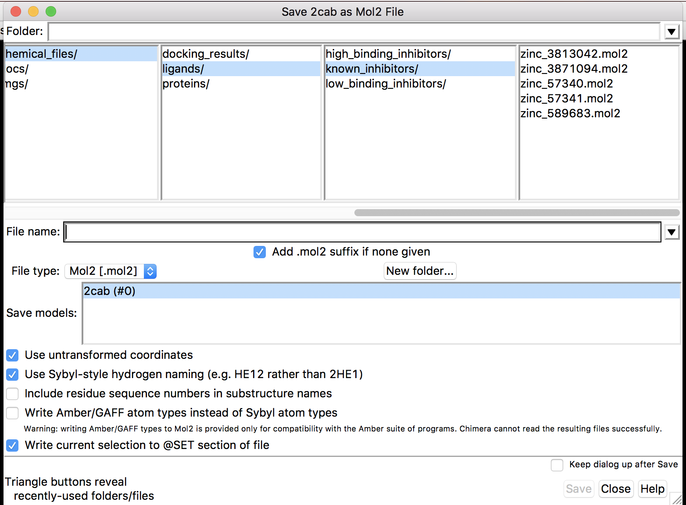
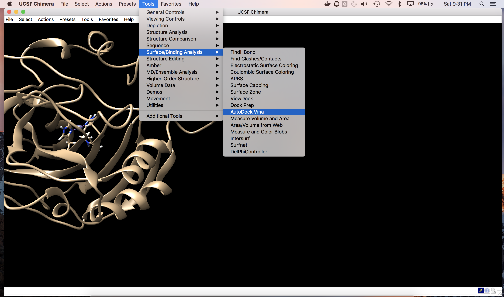
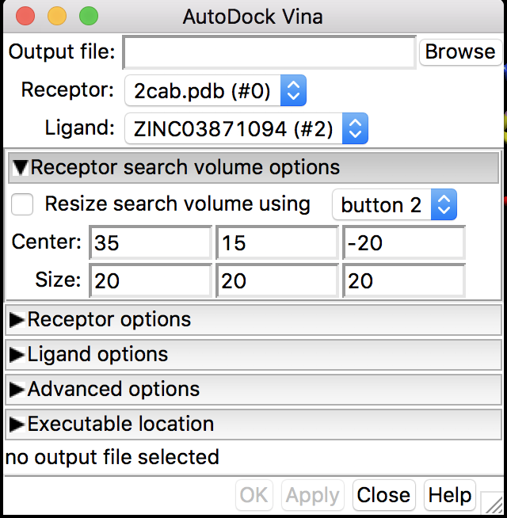
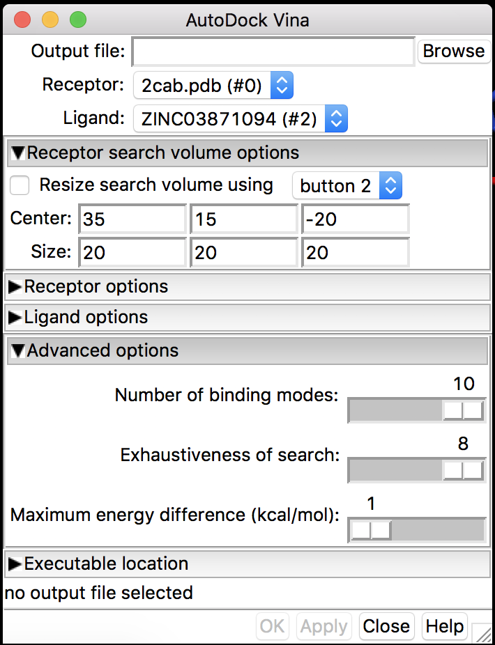

### Docking Ligands with proteins

Docking with Chimera and Autodock Vina is relatively simple. 

#### Protein Preparation

For Preparation of the protein. Download the protein or fetch by the PDB ID 2cab, link is provided in the README.md file. 

- Select the protein to prep with these parameters

- Add Hydrogens for the Dock Prep

- Assign charges for the protein

- Specify the Net Charges

- Save the File

#### Ligand Preparation

Since the files from ZINC are already minimized Mol2 Files the ligand is pre prepped for docking. We can use them out of the box from the download of the ZINC Database. 

#### Running Docking Simulation 

- Load both the dock prepped ligand and also the mol2 file. Select the Autodock Vina

- Select both the protein and the ligand and the output file

- Add in the Docking Parameters as shown and move to the search parameters

- Add in the Docking Search

- Click Okay and run the simulation. 
