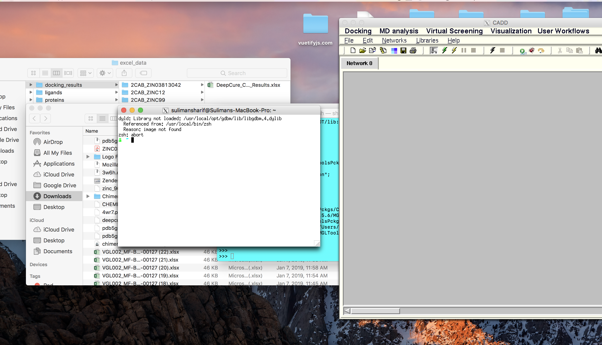
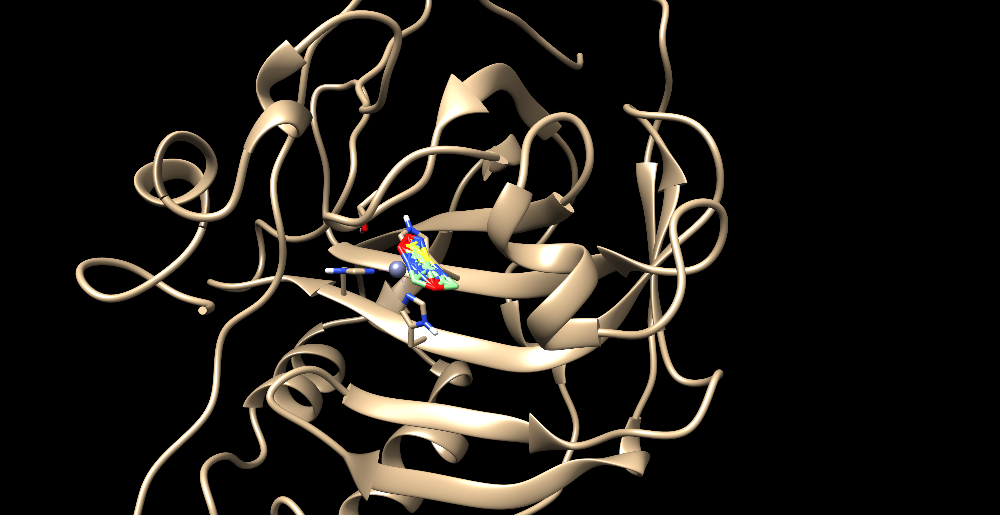

### Errors

#### XQuartz Error for installing

Major incompatibilities with MacOS High Sierra, XQuartz and for the docking simulation with CADD. Went on the hunt for the library module that was missing but was unable to find it. 
Error screenshot is shown below:

#### CHEMBL Error

Error for CHEMBL Data with Chimera doesn't work with ligand prep or minimization energy functions built within the software. Shows some contorted error ligands. Screenshot of the error is shown below:

