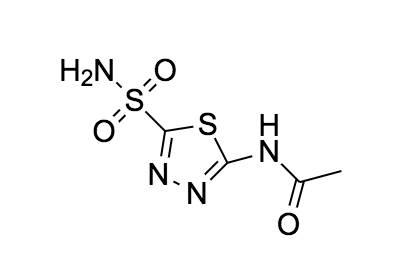

Known Inhibitors            |  Common Name
:-------------------------:|:-------------------------:
 |  Methazolamide ZINC03871094
  |  Polmacoxib ZINC0589683
 |  (R)-Methocarbamol ZINC00057341
 |  (S)-Methocarbamol ZINC00057340
 |  Acetazolamide ZINC03813042

Negative Inhibitors            |  Common Name
:-------------------------:|:-------------------------:
 |  Terphenyl ZINC03123664
  |  Triphenylbenzene ZINC 01664272

Positive Inhibitors            |  Common Name
:-------------------------:|:-------------------------:
 |  Adrafinil ZINC00000012
  |  Bucetin ZINC00000099
 |  Indol ZINC01261680

